# CSharpLINQ
> ####  LINQ reference code 
>
> ####  .NET은 특정 형식에 없던 기능을 추가하는 개념으로 확장 메서드(extension method)를 제공한다. C# LINQ에서 제공하는 확장 메서드를 사용해보자.

### 확장 메서드 사용하기

> #### .NET에서 확장 메서드를 사용하려면 System.Linq 네임스페이스를 선언해야 한다.
>
> #### 다음의 확장 메서드를 사용하여 숫자 배열 또는 컬렉션에서 원하는 값을 구할수 있다.

- #### Sum()	: 숫자 배열 또는 컬렉션의 합

- #### Count() : 숫자 배열 또는 컬렉션의 건수

- #### Average() : 숫자 배열 또는 컬렉션의 평균

- #### Max() : 최대값

- #### Min() : 최소값

### Sum() 메서드로 배열의 합 구하기

> #### 정수 배열 또는 컬렉션에 들어 있는 데이터의 전체 합을 LINQ.Sum() 메서드를 사용해 구한다.

- #### Sum()

### Count() 메서드로 배열의 개수 구하기

> #### Count() 확장 메서드로 정수 배열의 개수를 구한다.

- #### Count()

### Average() 메서드로 배열의 평균 구하기

> #### Average() 확장 메서드로 배열의 평균을 구한다.

- #### Average()

### Max() 메서드로 컬렉션의 최대값 구하기

> #### Max() 확장 메서드로 배열의 최대값을 구한다.

- #### Max()

### Min() 메서드로 컬렉션의 최소값 구하기

> #### Min() 확장 메서드로 배열의 최소값을 구한다.

- #### Min()

### 화살표 연산자와 람다 식으로 조건 처리

> #### LINQ에서 제공하는 확장 메서드들은 매개변수로 람다 식(lambda expression)을 받는데, 람다 식은 화살표 연산자 또는 람다 연산자라고 하는 화살표 모양의 => 기호를 사용한다.

>#### 람다 식은 다른 말로 화살표 함수(arrow function)라고도 한다.
>
>#### 화살표 연산자 또는 람다 연산자(lambda operator)로 표현되는 => 연산자는 일반적으로 영어로는 'goes to' 또는 'arrow'로 부른다.

| 종류    | 형태                     | 예                   |
| ------- | ------------------------ | -------------------- |
| 식 람다 | (입력 매개변수) => 식    | x => x+1             |
| 문 람다 | (입력 매개변수) => {문;} | x => {return x + 1;} |

### Where() 메서드로 IEnumerable<T> 형태의 데이터 가져오기

> #### Where() 메서드를 이용해 조건에 맞는 데이터만 받아서 출력해본다.

- #### Where()

### ToList()로 메서드로 IEnumerable<T>를 List<T>로 변환하기

> #### 람다 식을 사용하는 Where() 같은 확장 메서드를 호출할 때 IEnumerable<T> 대신에 List<T> 형태로 받으려면 ToList() 메서드를 한 번더 호출한다.

- #### ToList()

### Where() 메서드로 조건 처리하기

> #### Where() 확장 메서드는 람다 식을 사용하여 조건을 처리할 수 있습니다. 다음 코드를 보면 배열 또는 컬렉션에 Where() 메서드를 사용해서 짝수만 가져온 후 다시 Sum() 메서드로 짝수의 합만 구할 수 있습니다.

- #### CheckCondition

- #### CheckCondition2

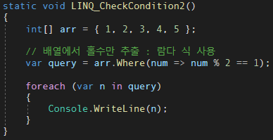

- #### CheckCondition3

- #### CheckCondition4

### All()과 Any() 메서드로 조건 판단하기

> #### LINQ의 All()과 Any() 메서드는 배열 또는 컬렉션에서 모든 조건을 만족하거나 하나의 조건이라도 만족해야 하는 경우를 판단합니다.

- #### All()

- #### Any()

### Take()와 Skip() 메서드로 필요한 건수의 데이터 가져오기

> #### LINQ의 Take와 Skip 확장 메서드를 사용해본다.
>
> #### Take 메서드는 특정 배열에서 원하는 수량만큼 데이터를 가져오는 메서드다.

- #### Take()

> #### Skip() 메서드는 지정한 수만큼 데이터를 제외한 컬렉션을 반환한다.

- #### Skip()

### Distinct() 확장 메서드로 중복 제거하기

> #### Distinct() 메서드를 사용하면 컬렉션(시퀀스)에서 중복된 데이터를 제거한다.

- #### Distinct()

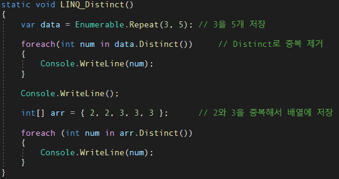

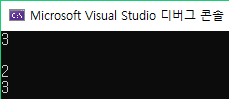

### 데이터 정렬과 검색

> #### LINQ의 확장 메서드 중에서 데이터를 오름차순으로 정렬할 때는 OrderBy()를 사용하고, 내림차순으로 정렬할 때는 OrderByDescending() 메서드를 사용합니다.
>
> #### 문자열 요소 3개를 가진 colors 배열을 사용하여 ABC 또는 가나다 순서의 오른차순으로 정렬된 새로운 값을 얻고 싶다면 OrderBy() 확장 메서드를 사용한다.

- #### OrderBy()

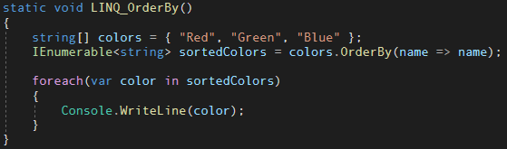

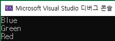

- #### OrderByDescending()

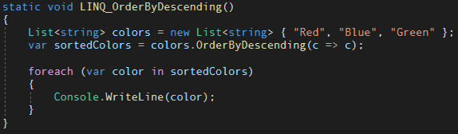

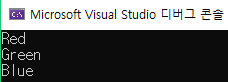

### 확장 메서드 체이닝

> #### 메서드 체이닝처럼 확장 메서드도 체이닝으로 여러 번 호출할 수 있다.

- #### MethodChain()

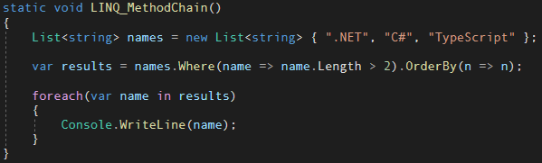

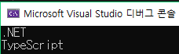

### 짝수인 데이터만 내림차순 정렬하기

> #### 11부터 20까지 정수를 가지고 짝수만 구한 후 이를 다시 내림차순 정렬한 데이터를 가져온다.

- #### UseCase()

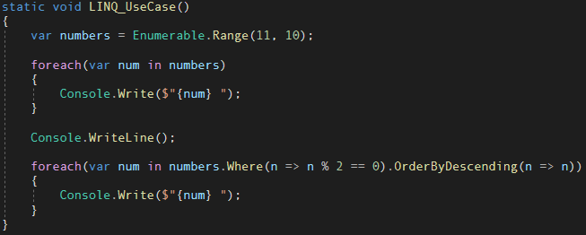

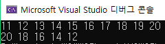

### Single()과 SingleOrDefault() 확장 메서드

> #### 컬렉션에서 조건에 맞는 값을 단 하나만 가져오는 확장 메서드에서는 Single()과 SingleOrDefault()가 있다.
>
> - #### Single() : null 값이면 예외가 발생한다
>
> - #### SingleOrDefault() : 값이 없으면 null 값을 반환합니다.

- #### SingleOrDefault()

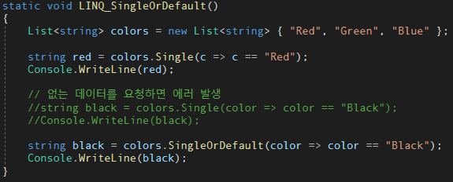

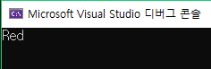

